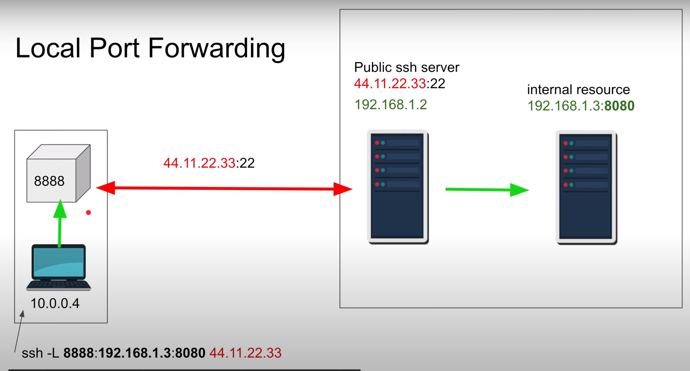

# Cpu throttle
If you're in a `cgroup` (cgroups (abbreviated from control groups) is a Linux kernel feature that limits, accounts for, 
and isolates the resource usage (CPU, memory, disk I/O, network, etc.) of a collection of processes.) then you can use 
the command `cat /sys/fs/cgroup/cpu/cpu.stat` it will give you a result like:

```
nr_periods 0
nr_throttled 0
throttled_time 0
```
If nr_throttled increases every time you run the command it means your process is throttling.

# SSH local port forwarding


`ssh -L {local_port}:{remote_internal_ip}:{remote_port} {ssh_ip}`

# venv
## Create a new virtual ENV
`python -m venv `
## Use the virtual ENV
`source environment1 /bin/activate`